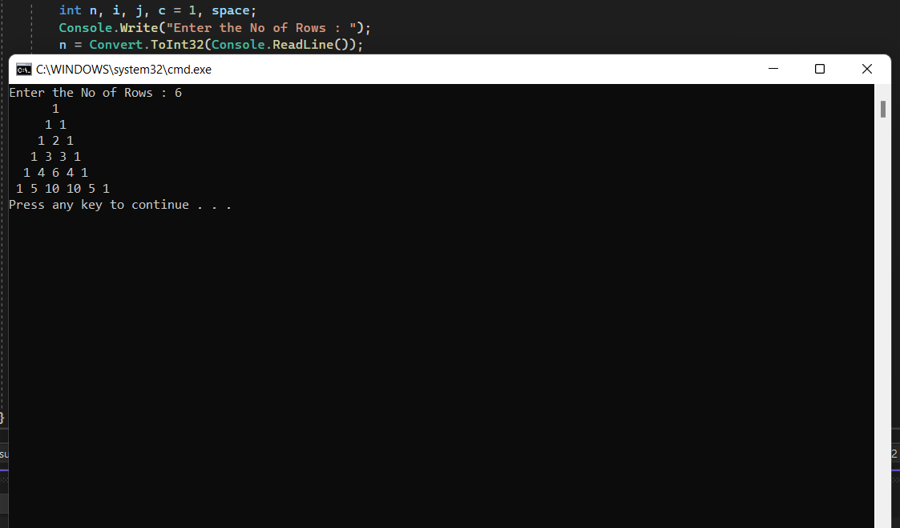

# Pattern

## Aim:
To write a C# program for a pascal's triangle.
## Equipment Required:
Microsoft Visual Studio 2022.

## Algorithm:
~~~
1.Start the program.

2.Get the limit from the user,use for loop to print the rows ,columns and space.

3.Use condition inside the loop to print the values.

4.Print the Pascal's triangle.

5.End the program.
~~~
## Program:
~~~
using System;
using System.Globalization;
namespace Pattern
{
    class Program
    {
        static void Main(string[] args)
        {
            int n,i,j,c=1,space;
            Console.Write("Enter the No of Rows : ");
            n=Convert.ToInt32(Console.ReadLine());
            for(i = 0; i < n; i++)
            {
                for(space=1;space<=n-i;space++)
                {
                    Console.Write(" ");
                }
               for( j=0 ; j<=i ; j++)
               {
                    if(i==0 || j==0)
                    {
                        c = 1;
                    }
                    else
                    {
                        c = c*(i - j + 1) / j;
                    }
                    Console.Write("{0} ",c);
                }
                Console.WriteLine();
            }
        }
    }
}
~~~

## Output:

## Result:
A C# program for a pascal's triangle is executed successfully.
